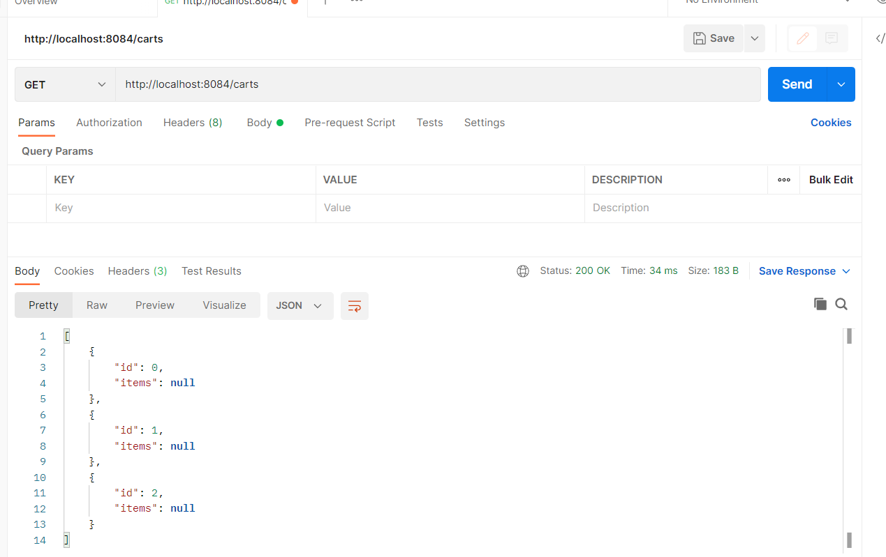
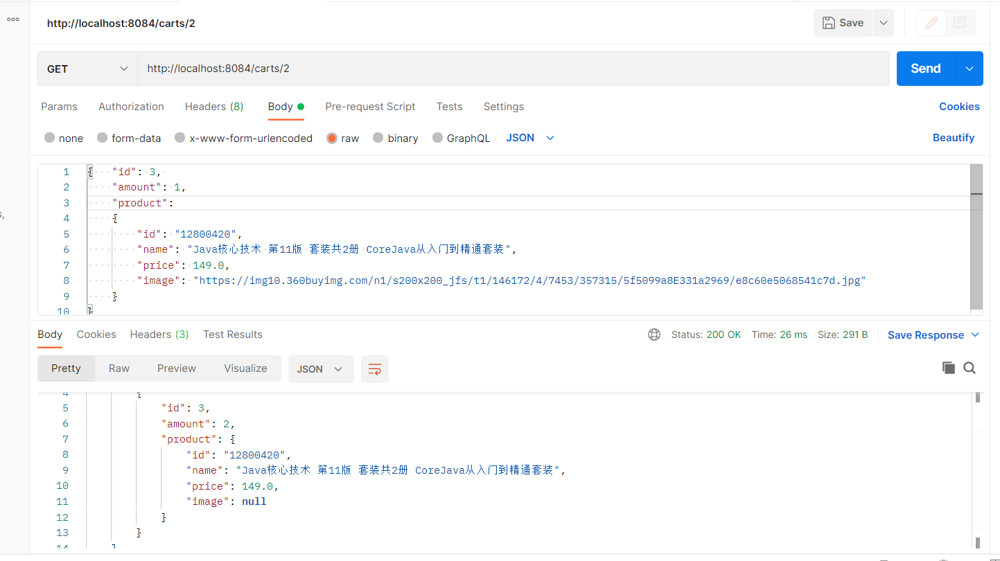
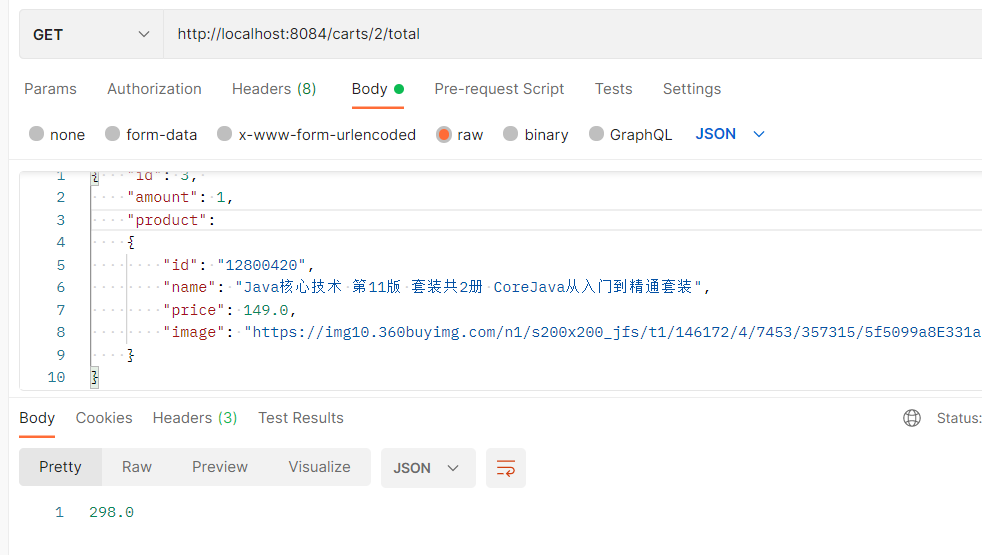

# RESTful microPoS 


请参考spring-petclinic-rest/spring-petclinic-microserivces 将aw04的webpos项目改为rest风格的微服务架构
（至少包含产品管理服务pos-products和购物车管理服务pos-carts以及discovery/gateway等微服务架构下需要的基础设施服务）。具体要求包括：

1. 请使用OpenAPI的定义每个服务的rest接口（参考pos-products）
2. 请使用ehcache管理缓存；
3. 请注意使用断路器等机制；
4. 有兴趣的同学可自学一些reactjs或vuejs等为microPoS开发一个前端。

对应端口号: 
discovery: 8761
cart: 8081
product: 8082，使用`ehcache`缓存，依赖配置文件`encache.xml`
counter: 8083
gateway: 8084

在gateway的application.yml文件中定义通过gateway访问其他服务的接口：

```yaml
   ...     
        - id: products
          uri: lb://pos-products
          predicates:
            - Path=/products/**
        - id: carts
          uri: lb://pos-carts
          predicates:
            - Path=/carts/**
```

运行它们并在浏览器上访问localhost:8761端口：


使用postman GEThttp://localhost:8084/products，获取所有的产品信息


对应`pos-api.yaml`文件中定义的接口listProducts(已在ProductController中实现)

```yaml
/products:
    get:
      summary: List all products
      operationId: listProducts
```

GEThttp://localhost:8084/products/{productId}，获取对应id的product信息：


POST http://localhost:8084/carts 生成一个新的购物车（需要一个requestBody以json格式填写cartDTO信息，id从0开始自动增加，items默认为0

GET http://localhost:8084/carts 获取所有购物车信息



尝试向id = 2的购物车中添加一个新的item（两次，观察到返回过来的body中amount = 2）：



Get /carts/2/total命令获取总价格为149 x 2 = 298：

