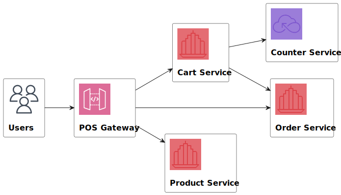
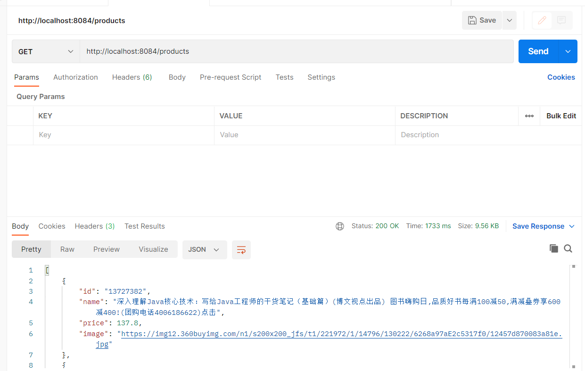
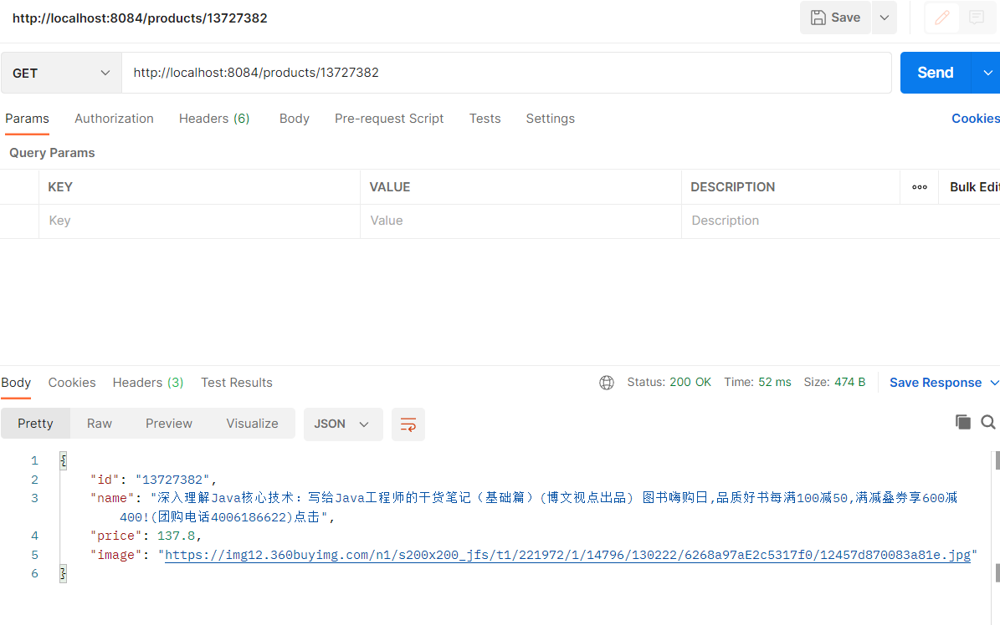

# RESTful microPoS 



请参考spring-petclinic-rest/spring-petclinic-microserivces 将aw04的webpos项目改为rest风格的微服务架构
（至少包含产品管理服务pos-products和购物车管理服务pos-carts以及discovery/gateway等微服务架构下需要的基础设施服务）。具体要求包括：

1. 请使用OpenAPI的定义每个服务的rest接口（参考pos-products）
2. 请使用ehcache管理缓存；
3. 请注意使用断路器等机制；
4. 有兴趣的同学可自学一些reactjs或vuejs等为microPoS开发一个前端。

对应端口号: 
discovery: 8761
cart: 8081
product: 8082，使用`ehcache`缓存，依赖配置文件`encache.xml`
counter: 8083
gateway: 8084

在gateway的application.yml文件中定义通过gateway访问其他服务的接口：

```yaml
   ...     
        - id: products
          uri: lb://pos-products
          predicates:
            - Path=/api/products/**
        - id: carts
          uri: lb://pos-carts
          predicates:
            - Path=/api/carts/**
        - id: counter
          uri: lb://pos-counter
          predicates:
            - Path=/api/counter/**
```

运行它们并在浏览器上访问localhost:8761端口：


使用postman GEThttp://localhost:8084/api/products，获取所有的产品信息



对应`pos-api.yaml`文件中定义的接口listProducts(已在ProductController中实现)

```yaml
/products:
    get:
      summary: List all products
      operationId: listProducts
```

GEThttp://localhost:8084/api/products/{productId}，获取对应id的product信息：



对应`pos-api.yaml`文件中定义的接口showProductById(在ProductController中自己实现)

```yaml
/products/{productId}:
    get:
      summary: Info for a specific product
      operationId: showProductById
```

```java
	@Override
    public ResponseEntity<ProductDto> showProductById(String productId) {
        ProductDto product = productMapper.toProductDto(this.productService.getProduct(productId));
        if (product == null) {
            return new ResponseEntity<>(HttpStatus.NOT_FOUND);
        }
        return new ResponseEntity<>(product, HttpStatus.OK);
    }
```

